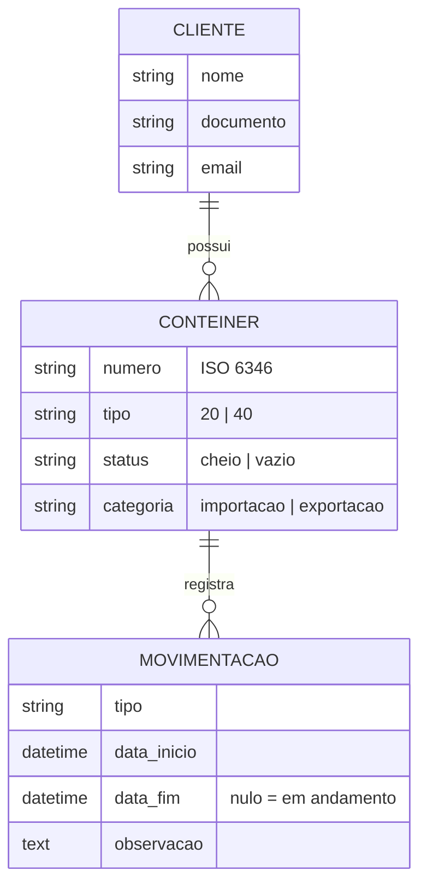

# 🚢 PortTrack — Gestão de Contêineres

[](https://github.com/MURILOBRAZ/TestePratico_Conteiners/actions/workflows/ci.yml)


Sistema web e API REST para controle de **clientes, contêineres e movimentações** em um terminal portuário:
cadastro com validação do código **ISO 6346**, histórico de operações (gate in/out, embarque, scanner…),
dashboard com indicadores e relatório exportável.

> **Demo:** _adicione aqui o link da Vercel_ · usuário `demo` · senha `demo1234`

---

## ✨ Funcionalidades

- **Dashboard** com KPIs, gráfico de movimentações dos últimos 30 dias e distribuição por tipo (Chart.js)
- **CRUD completo** de clientes, contêineres e movimentações, com busca, filtros e paginação
- **Validação ISO 6346** do número do contêiner, incluindo o cálculo do dígito verificador
- **Regras de negócio** garantidas em três camadas (formulário, model e _constraint_ no banco):
  a data de fim não pode ser anterior à de início
- **Movimentações em andamento** com botão para finalizar em um clique
- **Linha do tempo** com o histórico de cada contêiner
- **Relatório** por cliente × tipo de movimentação, com exportação em **CSV** (compatível com Excel)
- **API REST** documentada com **Swagger/OpenAPI**
- Autenticação, mensagens de feedback, **tema claro/escuro** e layout responsivo (Bootstrap 5)
- Proteção contra exclusão de clientes com contêineres vinculados

## 🧱 Stack

| Camada          | Tecnologias                                                        |
| --------------- | ------------------------------------------------------------------ |
| Backend         | Python 3.12+, Django 5.2 LTS, Django REST Framework, django-filter |
| Documentação da API | drf-spectacular (OpenAPI 3, Swagger UI, ReDoc)                 |
| Frontend        | Django Templates, Bootstrap 5, Bootstrap Icons, Chart.js           |
| Banco de dados  | SQLite (desenvolvimento) · PostgreSQL (produção)                   |
| Qualidade       | Testes com `unittest`/Django (33 testes, ~96% de cobertura), Ruff, GitHub Actions |
| Infraestrutura  | Docker, Docker Compose, WhiteNoise, Vercel                         |

## 🗂️ Estrutura

```
├── config/                  # settings, urls, wsgi (projeto Django)
├── conteineres/             # app principal
│   ├── api/                 # serializers, viewsets e rotas da API REST
│   ├── management/commands/ # seed_demo: popula dados de demonstração
│   ├── migrations/
│   ├── static/ templates/
│   ├── tests/               # testes de validators, models, views e API
│   ├── filters.py           # filtros compartilhados entre web e API
│   ├── services.py          # consultas agregadas (dashboard e relatório)
│   └── validators.py        # validação ISO 6346
├── .github/workflows/ci.yml # lint + testes com PostgreSQL
├── Dockerfile · docker-compose.yml · vercel.json
└── requirements.txt
```

## 🧩 Modelo de dados



## 🚀 Como rodar localmente

Pré-requisito: Python 3.12 ou superior.

```bash
git clone https://github.com/MURILOBRAZ/TestePratico_Conteiners.git
cd TestePratico_Conteiners

python -m venv .venv
# Windows (PowerShell): .\.venv\Scripts\Activate.ps1
# Linux/macOS:          source .venv/bin/activate

pip install -r requirements-dev.txt
cp .env.example .env          # Windows: copy .env.example .env

python manage.py migrate
python manage.py seed_demo    # cria o usuário demo/demo1234 e dados de exemplo
python manage.py runserver
```

Acesse http://127.0.0.1:8000 e entre com `demo` / `demo1234`.

### Com Docker

```bash
docker compose up --build
```

Sobe a aplicação com PostgreSQL em http://localhost:8000, já com migrations e dados de demonstração.

## 🔌 API REST

A documentação interativa fica em **`/api/docs/`** (Swagger) e **`/api/redoc/`**.
A autenticação é por sessão (login no site) ou HTTP Basic.

| Método | Endpoint                               | Descrição                                   |
| ------ | -------------------------------------- | ------------------------------------------- |
| GET/POST | `/api/clientes/`                     | Lista e cria clientes                       |
| GET/POST | `/api/conteineres/`                  | Lista (filtros: `status`, `tipo`, `categoria`, `cliente`, `q`) e cria contêineres |
| GET    | `/api/conteineres/{id}/movimentacoes/` | Histórico de um contêiner                   |
| GET/POST | `/api/movimentacoes/`                | Lista (filtros: `tipo`, `em_andamento`, `data_inicio_de`, `data_inicio_ate`…) e cria movimentações |
| GET    | `/api/relatorio/`                      | Movimentações por cliente e tipo            |
| GET    | `/api/dashboard/`                      | Indicadores gerais                          |

Os recursos também aceitam `GET/PUT/PATCH/DELETE` em `/{id}/`.

```bash
curl -u demo:demo1234 "http://127.0.0.1:8000/api/conteineres/?status=cheio&ordering=numero"
```

## ✅ Testes e qualidade

```bash
python manage.py test               # roda os testes
coverage run manage.py test && coverage report
ruff check . && ruff format --check .
```

A cada push, o GitHub Actions roda o lint e os testes contra um PostgreSQL real.

## ☁️ Deploy na Vercel

A Vercel executa o Django como função serverless. Como o sistema de arquivos lá é somente leitura,
**o SQLite não funciona em produção**: use um PostgreSQL gerenciado gratuito, como [Neon](https://neon.tech) ou
[Supabase](https://supabase.com) (ou o Postgres do marketplace da Vercel).

1. Crie o banco PostgreSQL e copie a _connection string_.
2. Localmente, aplique as migrations e os dados de demonstração **nesse banco**:
   ```bash
   # PowerShell: $env:DATABASE_URL="postgres://..."; $env:DJANGO_DEBUG="true"
   DATABASE_URL="postgres://...?...sslmode=require" DJANGO_DEBUG=true python manage.py migrate
   DATABASE_URL="postgres://...?...sslmode=require" DJANGO_DEBUG=true python manage.py seed_demo
   ```
3. Importe o repositório na Vercel (**Add New → Project**). O `vercel.json` já aponta para `config/wsgi.py`.
4. Em **Settings → Environment Variables**, configure:

   | Variável             | Valor                                           |
   | -------------------- | ----------------------------------------------- |
   | `DJANGO_SECRET_KEY`  | uma chave longa e aleatória                     |
   | `DATABASE_URL`       | a connection string do PostgreSQL               |
   | `DJANGO_DEBUG`       | `false`                                         |

5. Faça o deploy. Os arquivos estáticos são servidos pelo WhiteNoise, sem etapa extra de build.

Para gerar uma `SECRET_KEY`:

```bash
python -c "from django.core.management.utils import get_random_secret_key as k; print(k())"
```

> Como o usuário de demonstração pode editar e excluir dados, rode `python manage.py seed_demo --reset`
> (apontando para o banco de produção) sempre que quiser restaurar os dados de exemplo.

## 📄 Licença

Distribuído sob a licença MIT. Veja [LICENSE](LICENSE).

---

Desenvolvido por **Murilo Braz**.
